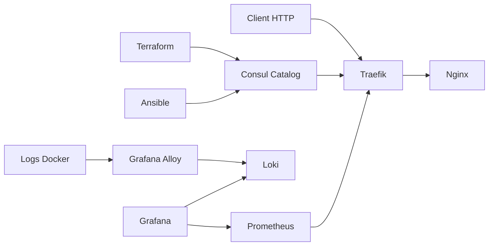

# Consul-Traefik Lab

Un laboratoire local et reproductible pour comprendre comment un reverse
proxy découvre dynamiquement ses services, puis comment observer le trafic
avec des métriques et des logs.

Le dépôt assemble Consul, Traefik, Terraform, Ansible, Prometheus, Grafana,
Loki et Grafana Alloy. Il fonctionne avec Docker Compose sur macOS et Linux.

## Ce que démontre le lab

- découverte de services avec Consul Catalog ;
- routage dynamique avec Traefik ;
- deux méthodes déclaratives d'enregistrement, Terraform ou Ansible ;
- collecte des métriques Traefik avec Prometheus ;
- collecte des logs Docker avec Grafana Alloy ;
- exploration des métriques et des logs dans Grafana ;
- configuration reproductible et validation automatisée.

## Architecture



## Prérequis

- Docker avec le plugin Compose ;
- Terraform 1.0 ou supérieur ;
- Ansible Core ;
- Python 3, `curl` et `make` pour les commandes de contrôle.

## Démarrage rapide

```bash
make up
make register-terraform
make smoke
```

Pour utiliser le parcours Ansible à la place :

```bash
make register-ansible
make smoke REGISTRATION=ansible
```

Terraform et Ansible constituent deux parcours alternatifs. Il n'est pas
nécessaire d'exécuter les deux pour utiliser le lab. Ne pas les mélanger sur
le même catalogue : avant de changer de parcours, faire `make down` puis
`make up`. Les volumes de métriques et de logs sont conservés.

Le parcours Terraform crée un nœud de catalogue sans agent. Il n'y déclare
aucun statut de santé artificiel : Traefik effectue un contrôle HTTP toutes
les 5 secondes et retire le backend défaillant du routage. Le parcours Ansible
enregistre le service auprès de l'agent Consul, qui exécute en plus son propre
contrôle HTTP toutes les 10 secondes. Le catalogue et l'agent sont deux API
différentes, pas deux façons équivalentes de lancer un check.

Consul tourne en mode développement : son catalogue disparaît quand son
conteneur est recréé. Après `make down` puis `make up`, refaire l'enregistrement.
Un 404 avant l'enregistrement est attendu.

Pour repartir d'une ancienne version du labo, utiliser aussi `make down` puis
`make up` avant l'enregistrement : supprimer un bloc `check` Terraform ne
retire pas nécessairement l'ancien check du catalogue existant.

## Interfaces locales

| Service | URL | Usage |
| --- | --- | --- |
| Nginx via Traefik | <http://nginx.localhost:8088> | Route découverte dans Consul |
| Nginx direct | <http://localhost:8080> | Comparaison sans reverse proxy |
| Consul | <http://localhost:8500/ui/> | Catalogue et santé des services |
| Traefik | <http://localhost:8081/dashboard/> | Routeurs et services découverts |
| Prometheus | <http://localhost:9090> | Cibles et métriques |
| Grafana | <http://localhost:3000> | Dashboards, métriques et logs |
| Loki | <http://localhost:3100/ready> | État du stockage de logs |
| Alloy | <http://localhost:12345> | État du pipeline de collecte |

Tous les ports publiés sont liés à `127.0.0.1`.

## Vérification

Les contrôles statiques ne démarrent aucun conteneur :

```bash
make verify
```

Ils valident Docker Compose, le format et la configuration Terraform, ainsi
que la syntaxe du playbook Ansible. Lorsque la stack tourne, `make smoke`
attend les endpoints avec un délai borné, vérifie la route et l'unicité du
service, la collecte Prometheus et l'arrivée d'une nouvelle requête Nginx
dans Loki via Alloy. Les tests utilisent explicitement l'adresse loopback
et le header Host, sans dépendre du DNS `.localhost` ou d'un proxy système.

Le test de panne arrête uniquement le conteneur Nginx de ce projet et le
redémarre dans un bloc de récupération, même si une assertion échoue :

```bash
make test-outage                       # parcours Terraform
make test-outage REGISTRATION=ansible  # parcours Ansible
```

Résultat attendu : Nginx répond 200, puis Traefik retourne 503 quand il retire
le backend. Avec Ansible, Consul détecte aussi la panne et Traefik peut retirer
la route (404). Après redémarrage, le 200 revient sans réenregistrement.
Un 502 persistant ne valide pas ce test : il signale un backend encore routé.

La CI teste séparément les deux parcours et la panne réelle de Nginx.

## Versions épinglées

| Composant | Version |
| --- | --- |
| Consul | 2.0.3 |
| Traefik | 3.7.12 |
| Prometheus | 3.14.0 |
| Grafana | 13.2.1 |
| Loki | 3.7.7 |
| Grafana Alloy | 1.19.2 |
| Nginx | 1.31.5-alpine |

Les versions sont explicites afin qu'un redémarrage du lab ne change pas
silencieusement son comportement.

## Organisation du dépôt

```text
.
├── ansible/       # Enregistrement dans Consul avec Ansible
├── docker/        # Stack locale, collecte et visualisation
├── docs/          # Parcours pédagogiques par composant
├── terraform/     # Enregistrement déclaratif dans Consul
├── tests/         # Contrôles HTTP, métriques, logs et panne réelle
├── Makefile       # Commandes courantes et contrôles
└── LICENSE
```

## Limites de sécurité

Cette stack est un environnement d'apprentissage, pas une base de production.
Consul fonctionne en mode développement, les ACL sont désactivées et les
interfaces Grafana et Traefik sont accessibles sans authentification depuis la
machine locale. Alloy lit les logs via le socket Docker, ce qui donne au
conteneur un accès sensible au moteur Docker malgré le montage en lecture
seule.

Ne déployez pas cette configuration sur une machine exposée. Une installation
de production doit notamment activer TLS, l'authentification, les ACL Consul,
un stockage persistant dimensionné et un accès au moteur Docker mieux isolé.

## Sources techniques

- [Consul en mode développement](https://developer.hashicorp.com/consul/docs/fundamentals/install/dev)
- [Provider Consul Catalog de Traefik](https://doc.traefik.io/traefik/providers/consul-catalog/)
- [API Catalog et différence avec les checks d'agent](https://developer.hashicorp.com/consul/api-docs/catalog)
- [Collecte des logs Docker avec Grafana Alloy](https://grafana.com/docs/alloy/latest/reference/components/loki/loki.source.docker/)
- [Migration de Promtail vers Grafana Alloy](https://grafana.com/docs/loki/latest/send-data/promtail/)

## Licence

Ce projet est distribué sous licence MIT. Voir [LICENSE](LICENSE).
